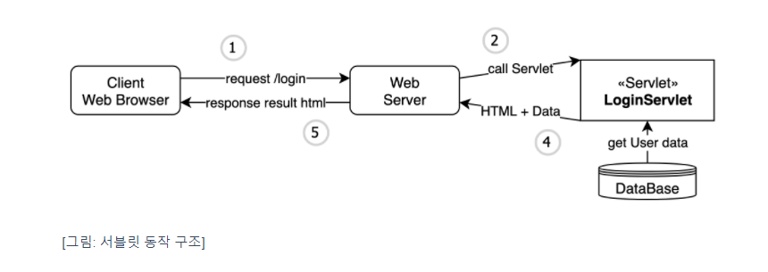
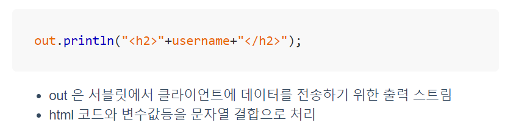
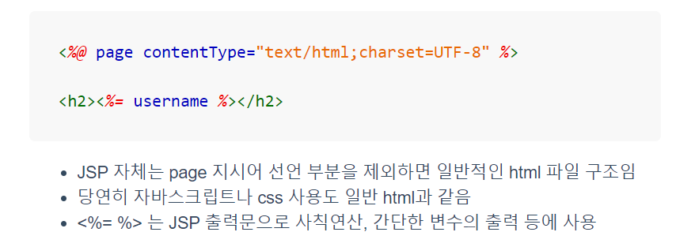
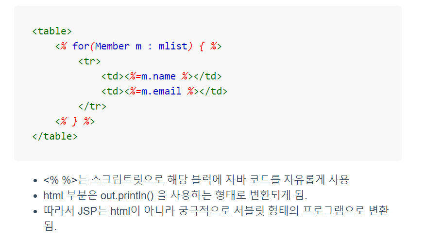
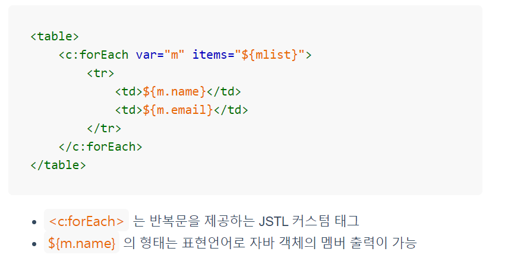

# JAVA 웹 프로그래밍

## 1.1 JAVA 웹 개발 개요

### 서블릿(Servlet) 과 JSP

서블릿(Servlet):

1. 클라이언트가 서버에 페이지(url) 요청
2. 서버는 요청 url에 매핑되는 servlet 을 호출 하면서 파라미터 전달
3. Servlet 이 실행되고 파라미터로 전달된 값을 처리하거나 DB 연동
4. Html과 Data를 조합하여 재구성한 다음 클라이언트에 리턴
5. 웹 브라우저는 수신받은 Html(js,css) 를 해석해서 표시

html 코드를 java에서 처리하기 위한 불편함, 비효율성을 개선하기 위한 JSP

JSP(Java Server Pages):

JSP는 서블릿에서 HTML과 DATA의 결합을 쉽게 처리하기 위한 목적,

HTML을 중심으로 데이터를 처리한다, HTML에서 java 입력 가능

JSP를 이용한 개발에도 몇 가지 문제가 있는데 게시판이나 상품 목록과 같이 데이터를 반복해서 출력하거나 조건 체크를 해야할 때 html만으로는 처리할 수 없기 때문에 JAVA를 중간중간 사용해야한다.

> JSP는 HTML + Java 코드로 구성되고 Servlet 컨테이너에 의해 서블릿 형태의 자바 코드로 변환된 다음 컴파일 되어 컨테이너에 적재되는 구조이다.

for 문 안에서 html과 조합하려면 서블릿과 마찬가지로 out.println 을 써야되서 코드가 복잡하고 가독성이 떨어진다.

이러하 문제를 해결하기 위해 JSTL(JSP Standard Tag Library) 및 EL(Expression Language)가 도입되게 되었다.

훨씬 구조적이고 가독성이 높아졌다. 이 같은 구조는 MVC 패턴과 함께 서블릿과 결합되어 자바 웹 개발의 정석으로 자리잡았다.

한계점: SSR(Server Side Rendering), 서버에서 빌드하는 구조이기 때문에 톰캣과 같은 서블릿 컨테이너를 통해야만 실행과정을 볼 수 있다. 디자인 변경에도 서버를 통해 실행되어야하므로 생산성과 디자이너와의 협업에서 문제가 되었다.

2010년 이후 JavaScript의 발전으로 전통적인 JSP 기반의 개발은 성장세를 잃음

Spring 프레임워크의 기본 템플릿 엔진인 타임리프를 사용하면 위와 같은 표현

### 새로운 웹 개발 트렌드

#### Java 언어의 대안:

Kotlin은 최신 프로그래밍 언어의 특징을 모두 갖고 있고, JVM에서도 돌아가기 때문에 자바와 완벽히 호환되면서 플랫폼 지원을 확대하는 중이다. Spring에서의 Kotlin 사용도 확대되고 있다.

#### Front-end 중심으로의 이동:

Front-end 중심의 개발이 가속화 되면서 서버 프로그램들이 보다 간결하게 전환되어 Node.js, Python을 이용한 서버 프로그램 개발이 늘어나고 있다. 특히   REST API 형태의 개발이 주를 이루게 되면서 백엔드에서는 화면을 다룰 일이 점점 줄어들고 있다.

데이터를 서버에서 조합하고 화면에 렌더링 하는 SSR 은 과거 데스크탑에서는 문제가 없었으나 스마트폰의 보급으로 인해 REST API 방식의 데이터 교환이 보편화되었다.

#### Spring 과 JSP:

국내에서는 거의 JSP 와 스프링을 함께 사용하지만, 권장되는 뷰 템플릿은 ThymeLeaf이다. Spring Boot 의 경우 JSP 사용에 제약이 있어서 그렇다.

#### JSP는 앞으로도 필요한가?

안드로이드 앱을 만드는데 데이터 서비스가 필요하다면 구글의 Firebase를 이용하거나 node, python 을 이용해 간단한 REST API를 제공하도록 하면 된다.

JSP 자체보다는 전반적인 웹프로그램 개발의 큰 그림을 이해하고 특히 자바 기반의 서버 프로그램, SPRING 기반의 백엔드 프로그램 개발을 메인으로 하되 최소한의 JSP에 대한 이해를 겸비하자.

출처:https://dinfree.com/lecture/backend/javaweb_1.1.html