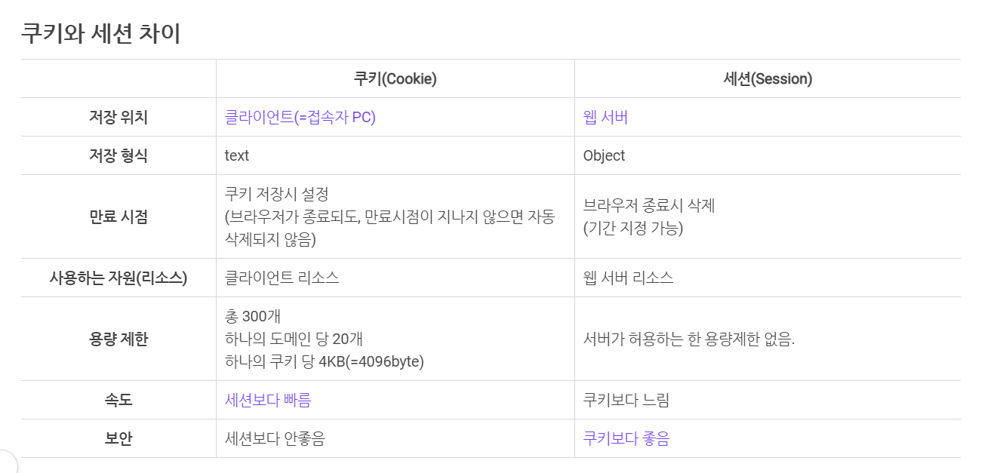
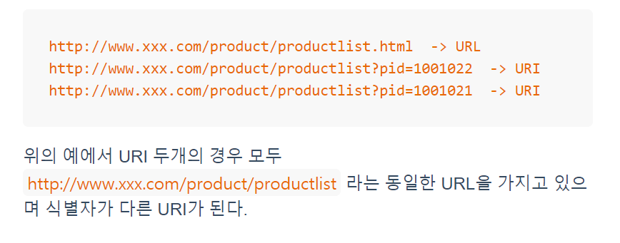
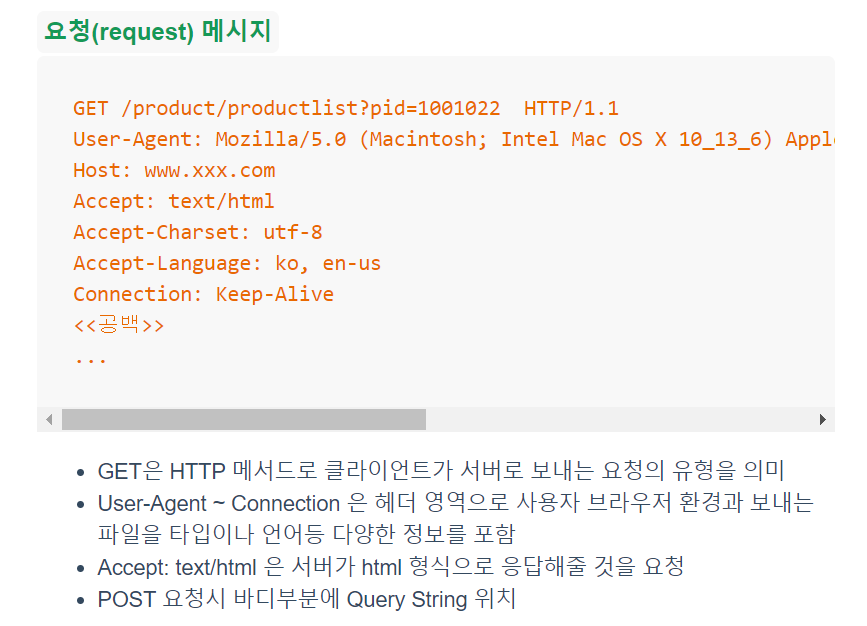
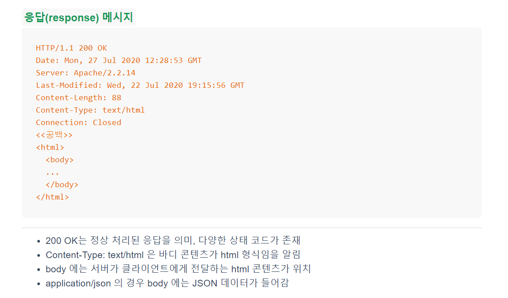
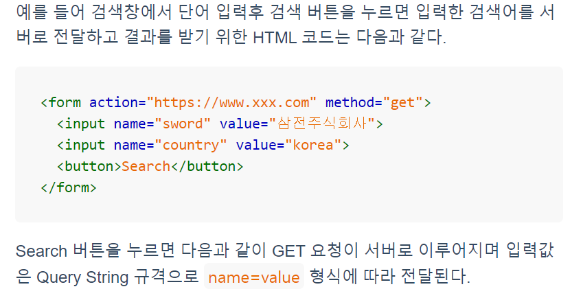
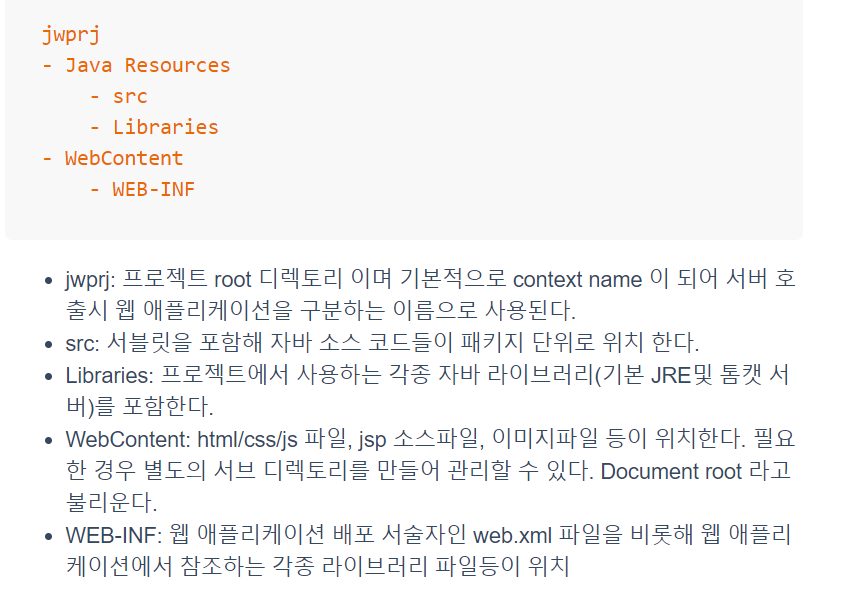
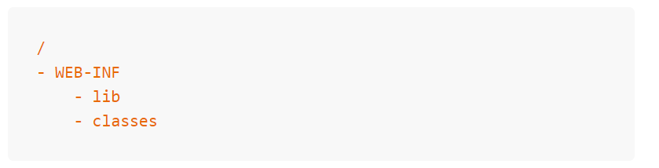

# 웹 애플리케이션과 HTTP

## HTTP(Hyper Text Transfer Protocol)

### HTTP 개요

HTTP는 월드와이드웹 서비스를 제공하기 위해 정의된 프로토콜이다.

네트워크 응용계층의 프로토콜로 클라이언트와 서버 사이의 데이터 통신을 위한 규격이며 웹의 경우 웹 브라우저가 클라이언트가 되면 톰캣과 같은 WAS가 설치된 컴퓨터는 서버가 된다.

HTTP는 Connectionless 방식으로 작동. 1연결 = 1자원 후 끊어짐

장점: 접속유지를 최소한으로 하여 많은 유저의 요청 처리 가능

단점: Stateless:클라이언트의 이전 상태를 알 수 없다, session 과 cookie로 해결

### URI 와 URL

URI(Uniform Resource Identifier)는 인터넷상의 모든 자원을 표기하기 위한 규격, URL(Uniform Resource Locator)은 URI의 서브셋으로 URI의 사용의 한 형태. URL은 구체적인 파일자원등에 대한 주소, URI는 실행경로와 파라미터를 포함한 형태.

### HTTP 메시지 구조

### HTTP Method

#### GET

특정 리소스의 표시를 요청. GET 을 사용하는 요청은 데이터를 받는 용도이지만 파라미터(Query String)을 통해 일부 클라이언트에서 작성된 데이터를 서버로 전송할 수 있다.

브라우저를 이용할 때 주소창에 요청 URL이 노출되어 보안에는 취약.

#### POST

특정 서버 리소스(서블릿 등)에 데이터를 전송할 때 사용된다. GET 방식과는 달리 웹 브라우저의 주소창에 데이터 부분은 보이지 않으며 데이터는 Request Body 에 포함되어 전달된다.

이밖에도

HEAD: Get과 동일하지만, 응답 본문 포함 x

PUT : POST 와 유사하지만 업데이트할 때 사용

DELETE : 리소스 삭제하기 위한 메서드

### WAS(Web Application Server)

웹 애플리케이션을 구동하는 서버, Tomcat , JavaEE 같은 Servlet Container 필요

실제 서비스 시스템 구축시에는 정적 컨텐츠 서비스를 위한 Web Server 와 WAS를 병행해 운영하며 설정을 통해 상호 연동되는 구조를 가진다.

### 웹 어플리케이션

웹 서비스를 제공하기 위해 만들어진 일종의 프로그램, 웹 브라우저의 URL 요청에 따라 웹 서버를 통해 실행된다. 웹 어플리케이션은 HTML,CSS,Js, 이미지 파일, 멀티미디어 파일 등의 컨텐츠를 모두 포함한 개념.

### 웹 프로젝트 구조

### WAR(Web Application aRchive)

웹 어플리케이션을 실행하기 위한 모든 리소스를 포함하고 있기 때문에 서버에서 별도의 설정없이 바로 실행 가능하다.

#### WAR 구조

war 파일은 애플리케이션 단위로 생성하기 때문에 최상위 디렉토리(/, root)에 이클립스 프로젝트의 WebContent 디렉토리가 위치하는 구조 이다

기본적으로 war 생성시 자바 소스 파일은 제외되며 옵션으로 포함시킬 수 있지만 대부분의 경우 포함하지 않는다. 대신 컴파일된 클래스 파일들만 복사가 되며 WEB-INF/classes 폴더로 이동하게 된다.

WEB-INF/lib 폴더에는 웹 애플리케이션에서 사용하는 각종 라이브러리들이 위치하게 된다. maven, gradle 과 같은 빌드 도구를 사용하지 않을 경우 모든 라이브러리 파일들은 이클립스 프로젝트의 WEB-INF/lib 에 두어야 하며 빌드 도구를 사용할 경우에는 이클립스에서 라이브러리 관리를 자동으로 하기 때문에 별도의 작업이 필요 없다. war파일 생성시 빌드 설정에 포함된 라이브러리들은 WEB-INF/lib 폴더로 복사되게 된다.

war 생성은 CLI 방식의 명령도구를 직접 사용하거나 이클립스에서 제공하는 export 기능을 이용해 생성할 수 있다. 빌드 도구를 사용하는 경우에는 빌드 설정을 통해 직접 war 파일을 생성하거나 자동으로 원격 서버에 배포하는 작업등을 수행할 수 있다.

출처:https://dinfree.com/lecture/backend/javaweb_1.3.html

------