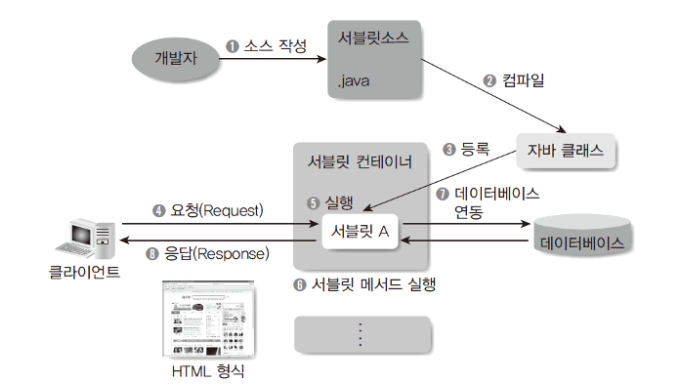
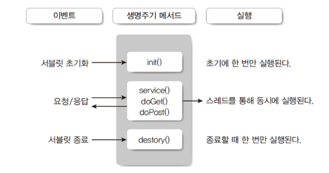

# 2.1 서블릿

### 서블릿(Servlet) 개요

자바로 만들어진 프로그램을 서버에서 실행하기 위해 만들어졌다. 데이터베이스 연동, 외부 서비스 연동을 통해 동적인 정보 제공을 가능하게 한다.

### 서블릿 개발 및 동작 구조



1. HttpServlet 클래스를 상속받는 서블릿 클래스를 작성
2. 컴파일 후 웹 애플리케이션으로 패키징
3. 서블릿 컨테이너에 배포
4. 클라이언트의 URL 요청
5. 애너테이션에 등록된 URL 매핑정보를 참고해 해당 서블릿 실행
6. 요청 메서드에 따라 서블릿의 doGet(), doPost() 등의 메서드 호추 
7. 서블릿은 데이터베이스 연동 등 필요한 작업을 수행
8. 데이터를 포함한 HTML 형식의 데이터를 클라이언트에게 전달


### 서블릿의 장단점

장점

- 자바 기반으로 자바 API를 모두 이용가능
- 운영체제, 하드웨어의 영향을 받지않아서, 다양한 서버환경에서 실행가능
- 웹앱에서 효율적인 자료 공유 방법을 제공
- 다양한 오픈소스 라이브러리와 개발도구 활용 가능

단점

- HTML 응답을 위해 출력문으로 문자열 결합을 사용해야 한다.
- HTML 을 서블릿에서 포함할 경우 화면 수정이 어렵다.
- HTML form 데이터 처리가 불편하다.
- 기본적으로 단일 요청과 응답을 처리하는 구조로 다양한 경로의 URL 접근을 하나의 클래스에서 처리하기 어렵다.(eg. Rest API 구현)


### 서블릿 클래스 구현

서블릿 자체는 자바코드로 구현하지만 서블릿 컨테이너에 해당 클래스가 서블릿임을 알려야 하고 어떤 URL 접근에 실행해야 하는지 등록하는 과정이 필요하다. 기본적으로는 웹 애플리케이션 배포 서술자인 `web.xml` 에 등록해야 하지만 지금은 별도의 web.xml 작성 없이 `자바 애너테이션`을 이용한 방법이 사용되고 있다.


### 서블릿 클래스 구조

서블릿 클래스는 `javax.servlet.Servlet` 인터페이스를 구현한 추상 클래스인 GenericServlet 클래스와 HttpServlet 클래스중 하나를 상속해 구현하는 형태이다. 일반적인 웹 개발의 경우 HTTP 프로토콜에 최적화 되어 있는 `HttpServlet` 클래스를 상속해서 구현한다.

서블릿이 제공하고자 하는 HTTP 메서드에 따라 doGet(), doPost()등의 메서드를 오버라이딩해서 필요한 내용을 구현하면 된다.

```java
public class HelloWorldServlet extends HttpServlet {
    public doGet(HttpServletRequest request, HttpServletResponse response) throws ServletException, IOException {
        ...
    }
    
    public doPost(HttpServletRequest request, HttpServletResponse response) throws ServletException, IOException {
        doGet(request, response);
    }
    ...
}
```

- doGet() : HTTP GET 요청을 처리하기 위한 메서드
- doPost(): HTTP POST 요청을 처리하기 위한 메서드로 보통 doGet()을 호출해 동일하게 처리

doGet(), doPost() 메서드에서 파라미터로 사용되고 있는 request와 response 는 서블릿 컨테이너가 클라이언트 요청과 응답을 처리할 수 있도록 서블릿에 제공하는 객체로 클라이언트와의 상호작용에 필요한 다양한 메서드를 제공하고 있다.


#### HttpServletRequest

HTTP 프로토콜의 request 정보를 서블릿에게 전달하기 위한 목적으로 사용한다. 헤더정보, 파라미터, 쿠키, URI, URL 등의 정보를 읽어 들이는 메소드를 가지고 있으며 Body의 Stream을 읽어 들이는 메소드를 가지고 있다.

#### HttpServletResponse

서블릿컨테이너는 요청 클라이언트에게 응답을 보내기 위한 HttpServletResponse 객체를 생성하여 서블릿에게 전달한다. 서블릿은 해당 객체를 이용하여 content type, 응답코드, 응답 메시지등을 전송할 수 있다.


### 서블릿 정보 등록

서블릿 클래스만으로는 톰캣에서 실행이 불가능 하며 web.xml 이나 애너테이션으로 서블릿 임을 선언해야 한다.

기존 web.xml의 예시

```java
<?xml version="1.0" encoding="UTF-8"?>
<web-app ...>
  <servlet>
    <servlet-name>HelloWorld</servlet-name> //servlet 이름
    <servlet-class>jwprj.servlet.HelloServlet</servlet-class> //서블릿 클래스 지정
  </servlet>
  
  <servlet-mapping>
    <servlet-name>HelloWorld</servlet-name> //servlet name을 매핑
    <url-pattern>/hello</url-pattern>  //서블릿 요청 주소 매핑
  </servlet-mapping>
</web-app>
```


`서블릿 3.0` 에서 부터는 자바 애너테이션을 이용해 다음과 같이 등록한다. 물론 필요하다면 web.xml을 사용하는 것도 가능하지만 애너테이션 사용이 권장 된다.

```java
@WebServlet(description="Hello World Servlet", urlPatterns="/hello")
public class HelloWorldServlet extends HttpServlet{
    ...
}
```

### 서블릿 생명주기

서블릿 클래스는 기본적으로 `doGet(),doPost()` 와 같이 HTTP 요청 메서드에 따라 필요한 메서드를 오버라이딩해 구현하는 구조이며 서블릿 컨테이너에 의해 `객체의 생성과 소멸` 등이 관리 되므로 필요에 따라 특정 라이프사이클 이벤트에 동작하는 메서드를 구현하기도 한다.



1. 사용자 URL 요청에 따른 서블릿 실행
2. 이때 서블릿 인스턴스가 생성되지 않았다면 인스턴스 생성 후 `init()`메서드 호출
3. 이미 객체가 생성되어 있는 경우라면 각 요청별로 WAS에서 스레드를 생성해 서블릿의 `service()` 메서드 호출
4. 사용자 요청에 따라 `doGet(), doPost()`  등 메서드 호출
5. 서블릿 컨테이너의 종료를 포함해 서블릿 변경등 기존 서블릿을 정리해야 할때 `destroy()`메서드 호출

#### 서블릿 초기화: `init()` 메서드

클라이언트 요청이 들어오면 컨테이너는 해당 서블릿이 메모리에 있는지 확인한다. 해당 서블릿이 메모리에 없을 경우에는 서블릿을 메모리에 다시 적재해야 하는데, 이때 서블릿의 `init()`메서드가 호출되며 각종 초기화 작업을 수행한다.

즉 `init()`메서드는 처음 한 번만 실행되므로 해당 서블릿에 각각의 스레드에서 공통적으로 사용하기 위해 필요한 작업이 있다면 init()메서드를 오버라이딩해서 구현한다.

만약 실행 중 서블릿이 변경될 경우에는 기존 서블릿은 종료(destroy) 되고 새로운 내용을 다시 적재하려고 init() 메서드가 호출된다.

#### 요청/응답 : `service()`메서드

`init()`메서드는 최초에 한 번만 수행되고 이후 요청은 스레드로 실행되며, 각각 `service()`메서드를 통해 `doGet()`이나 `doPost()`로 분기된다. 이때 파라미터로 HttpServletRequest와 HttpServletResponse 클래스 타입인 request와 response 객체가 제공되는데, 사용자 요청 처리는 request로 , 응답 처리는 response 객체로 처리한다.

#### 서블릿 종료: `destroy()` 메서드

컨테이너로부터 서블릿 종료 요청이 있을 때(대부분의 경우 컨테이너가 종료될 때지만 컨테이너는 실행된 상태에서 특정 서블릿을 로드/언로드하는 기능이 있다.)   destroy() 메서드를 호출한다. init() 메서드와 마찬가지로 한 번만 실행되며, 서블릿이 종료되면서 정리해야할 작업이 있을 때는 destroy() 메서드를 오버라이딩해서 구현하면 된다.


### 올바른 서블릿 활용

일반적으로 서블릿은 MVC 패턴에서 컨트롤러의 역할 구현을 위해 사용하게 된다. 클라이언트로 부터 전달되는 데이터(form 입력 데이터, url 파라미터등)를 처리하기 위한 다양한 방법과 효과적인 데이터 처리를 위한 객체 매핑 url redirection 이나 forwarding 개념에 대해서도 이해가 필요하고 자유롭게 구현할 수 있어야 한다.

또한 리스너와 필터와 같은 특수한 성격의 서블릿을 통해 관리 혹은 서비스 전반에 걸쳐 필요한 기능의 구현이 필요할 수 있으므로 이에 대해서도 잘 알아두도록 한다.

다음은 올바른 서블릿 활용을 위해 필요한 것들이다.

- MVC 패턴 기반의 웹 애플리케이션 설계
- 뷰 템플릿 엔진의 사용(JSP, Freemaker 등)
- form 처리를 위해 Apache Commons BeanUtils 라이브러리 사용
- RestAPI 구현의 경우 JAX-RS 사용
- 리스너와 필터 서블릿의 활용
- request, response, session, ServletContext 객체의 이해와 활용


출처: https://dinfree.com/lecture/backend/javaweb_2.1.html