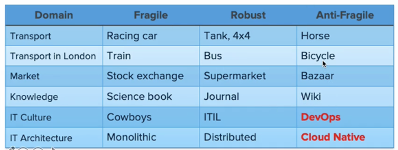
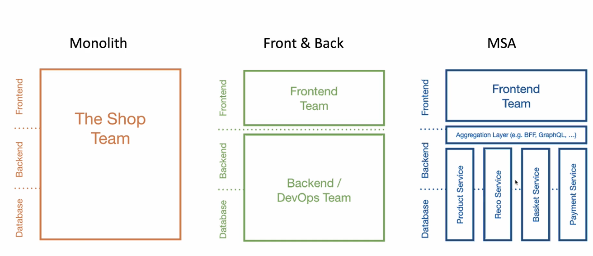

# 소프트웨어 아키텍처

## MicroService란

IT 시스템의 변천사

1960~1980 : Fragile, Cowboys

- 하드웨어가 고가였기 때문에 변경 비용이 높았다.

1990 ~ 2000: Robust, Distributed

- 분산을 하더라도 안정적으로 성능이 높도록 유지할 수 있었다.

2010~: Resilent/Anti-Fragile,  Cloud Native

- 지속적인 개선

## Anti-Fragile

- Auto Scaling
- MicroServices
  - 넷플릭스의 MicroServie 구조
  - 
- Choas engineering
  - 예측 못한 순간도 견딜 수 있도록 견고한 설계를 가져간다.
- Continuous deployments
  - 수십~수백개의 프로젝트를 테스트,빌드하고 배포하기 위해서 필수적이다.
  - 배포 파이프라인을 통해 지속적인 통합과 배포

# Cloud Native Architecture

- 확장 가능한 아키텍처
  - 시스템의 수평적 확장에 유연
  - 확장된 서버로 시스템의 부하 분산, 가용성 보장
  - 시스템 또는, 서비스 애플리케이션 단위의 패키지(컨테이너 기반 패키지)
- 탄력적 아키텍처
  - 분할된 서비스 구조
  - 무상태 통신 프로토콜
  - 분리된 서비스 끼리 종속성을 가지면 안되고, 연동이 잘 돼야한다.
- 장애 격리
  - 특정 서비스에 오류가 발생해도 다른 서비스에 영향 주지 않음

# Cloud Native Application

- MicroService 로 개발

- CI / CD

  - 지속적인 통합과 지속적인 배포

- DevOps

  - 개발 - QA - Operation
  - 사이클을 지속적으로 반복할 수 있도록 한다.

  

- Container

  - 클라우드 환경으로 옮겨서 구축한다.

# 12 Factors

1. 베이스 코드 : 버전을 관리하기 위해서 코드의 통일적인 관리가 필요하다.
2. 종속성 : 각 코드는 독립적으로 구성
3. 구성정보 : Microservce에 필요한 구성이 저장된다.
4. 서비스 지원 : 보조 서비스 DB, Messaging을 통해서 Microservice 지원
5. 빌드와 릴리즈를 분리한다.
6. 프로세스 : 각 서비스는 분리되어 환경에서 운영될 수 있어야 한다.
7. 포트 바인딩 : 자체 포트에서 노출되는 인터페이스가 있어야 한다.
8. 동시성 : 하나의 서비스가 여러 개로 분리되어 나간다.
9. 서비스가 삭제가 가능해야 한다.
10. Dev와 Prod를 분리한다. 
11. 로깅 시스템 필수, 이벤트 스트림으로 관리해야 한다. 별도의 추가적인 서비스나 모니터링 도구가 필요하다.
12. 현재 운영되는 작업을 관리하는 도구가 필요하다.

# 최근에 추가한 +3

1. API First
2. Telemetry : 시각화 해서 관리
3. Authentication and authorization : 적절한 인증을 가지고 있는 서비스가 있어야 한다.

# Monolithic vs Microservices

## Microservice 란?

- 샘뉴먼은 함께 작동하는 작은 서비스의 모음

- HTTP를 통해 서로 통신할 수 있는 작은 서비스의 묶음
- 완전하게 자동화된 배포 시스템을 가져야한다.

> 중앙화된 관리 체계와 각 서비스는 다른 언어로 작성될 수 있고, 독립적인 DB를 사용할 수 있다. -마틴 파울러

- 비슷하게 Front와 Back을 분리하여 개발하는 방식도 있다. -> 모바일 애플리케이션에서 자주 보임

# Microservice Architecture란?

각 서비스의 마이크로서비스들끼리의 유기관계

제프 베조스가 보낸 이메일

1. 팀끼리는 인터페이스를 노출시키고, 오직 이를 통해서만 소통할 것이다.
2. 어떤 기술을 쓰는지 상관하지 않는다.
3. 모든 서비스 인터페이스는 외부에 공개할 수 있도록 구현되어야 한다.

# SOA와 MSA의 차이점

SOA - 재사용을 통한 비용 절감

MSA - 서비스간 결합도를 낮추어 변화에 능동적으로 대응

REST API를 통해서 통신하는 성숙도 모델

SOA와 MSA의 차이

- EventStream을 통해서 데이터 동기화를 진행할 수도 있다.
- 각 서비스가 다른 언어와 다른 DB를 사용해도 된다.

# MSA 표준 구성요소

- CNCF는 각 구성요소에서 자주 사용하고 있는 아키텍처의 제품을 소개한다.

1. 클라이언트에서 API Gateway를 통해서 필요한 서비스를 요청한다.
2. ServiceDiscovery에서 어디로 향해야 하는지 알려준다.
3. LoadBalancer에 의해서 A,B MicroService 어디로 가야할지 알려준다.
4. Config Store를 통해서 환경설정을 관리한다.
5. 컨테이너 오케스트레이션을 통해서 구축되어 있을 것이다.
6. CI / CD를 통해서 배포될 때 관리자를 통해서 이뤄질 것이다.

## Service Mesh

서비스 메쉬는 하나의 개념이다. 효율적인 MSA 운영에 목적이 있다

