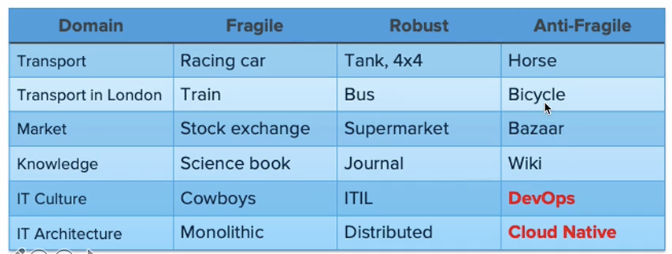

# 소프트웨어 아키텍처

## MicroService란

IT 시스템의 변천사

1960~1980 : Fragile, Cowboys

- 하드웨어가 고가였기 때문에 변경 비용이 높았다.

1990 ~ 2000: Robust, Distributed

- 분산을 하더라도 안정적으로 성능이 높도록 유지할 수 있었다.

2010~: Resilent/Anti-Fragile,  Cloud Native

- 지속적인 개선

## Anti-Fragile

- Auto Scaling
- MicroServices
  - 넷플릭스의 MicroServie 구조
  - 
- Choas engineering
  - 예측 못한 순간도 견딜 수 있도록 견고한 설계를 가져간다.
- Continuous deployments
  - 배포 파이프라인을 통해 지속적인 통합과 배포